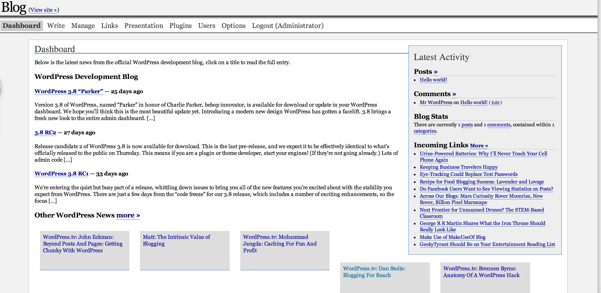
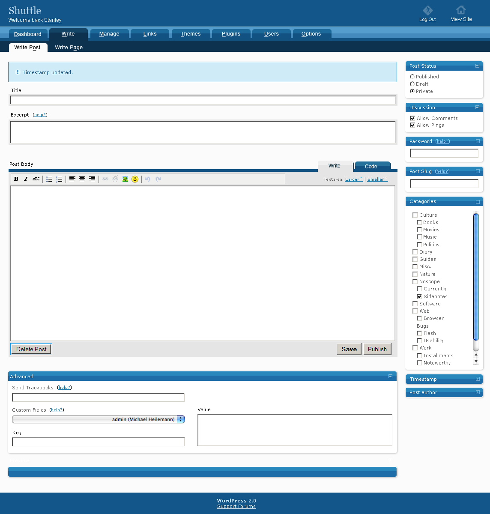

## 18. Shuttle

As experiments went on about how to make money in the project, experiments also happened in the interface design. WordPress inherited its look from b2 and was worked over by successive developers, but it had never been overhauled by a designer. Between 2005 and 2006 the members of the [wp-design mailing list](http://lists.automattic.com/pipermail/wp-design/) worked on an aesthetic overhaul of the admin screens. They called the project Shuttle. Their aim was to create a coherent brand for WordPress, starting with a redesign of the admin. . 

The group focused on reimagining and modernising the WordPress admin, an aesthetic refresh, as opposed to a functional refresh, i.e. changing the design elements rather than re-architecting the interface or adding new features. They started work in the wake of WordPress 1.5, which came out with a set of admin screens in need of some love. 

 

Unlike WordPress core development, the Shuttle group ccommunicated on a private mailing list. This was open to other members but the list archives weren't public. To get involved, a contributor had to be added to the group, and the group had to agree to add the new member. Discussions amongst the members indicate that they weren’t keen for too many people to join.

This highlights one of the tensions between design, which is usually a private process that leads to a finished design that is presented to the world, and free software development. Linus's Law ([as outlined by Eric Raymond](http://www.catb.org/esr/writings/homesteading/cathedral-bazaar/ar01s04.html)) is that "given enough eyeballs, all bugs are shallow." If there is a problem, get lots of eyes on it; it will be transparent to someone. This works with bugs or a coding problem with a clear answer.

Design, however, is much more subjective, and all of the designers involved with the Shuttle project felt that opening up the design process to anyone at all would lead to a case of "too many cooks". "A mailing list like that," recalls Chris Davis now, "would become so much noise and so little signal so quickly that there would be no way we could move forward." 

To try and avoid this scenario, the group was kept small, with three main designers (Michael, Joen, and Khaled) and a number of coders responsible for realising the vision. The group worked from a set of PSDs and sent designs around amongst themselves, providing feedback on each other's work and iterating on the design. This focused on design specific elements, mainly the Post screen (post.php). Over the project they sent 28 different versions to the mailing list. 

Version 8

 

Version 14

 

Version 21

 

Version 26

 
 
As the design process continued, elements of Shuttle were implemented in WordPress. One of the earliest Shuttle designs increased the size of the title field in the post.php edit screen.

In WordPress 1.5:

In Shuttle:

WordPress 2.0:

Another change was pods in the Post screen which collapsed elements such as post status, categories, and author.

In WordPress 1.5:

In version 8 of Shuttle:

In WordPress 2.0

When WordPress 2.0 shipped with Shuttle-inspired changes the feedback wasn’t entirely positive. On her blog, [Molly Holzschlag wrote that](https://web.archive.org/web/20060203042213/http://www.molly.com/2006/01/05/wordpress-20-and-akismet/) "what WP2.0 has gained in interface appeal it's lost in some practicality too." For the Shuttle team, the problem with WordPress 2.0 was the [piecemeal implementation of their vision](http://lists.automattic.com/pipermail/wp-design/2006-January/000559.html).

The project was beset by other problems. Despite having a closed mailing list to avoid the "too many cooks" problem, that problem arose anyway. The structure of the group gave no one responsibility for the overall vision of the project. Ideas were discussed and sent around. When one reads back the mailing list now it feels like a design-focused discussion forum rather than a team with a clear task.  No one had sole responsibility for the vision of the group and no one stepped up to take that role on. As the group discovered, having a group of designers, each with their own ideas, can cause as many problems as opening a design list up to a bunch of hackers.

It took the group a long time to get work done. A lot of time was spent discussing minor elements of the design such as rounded corners and gradients, rather than asking fundamental questions about WordPress users, what they needed and what they wanted. "I don’t know if we were cooperating enough on getting a unified feel and a unified understanding of everything before we were trying to actually apply our ideas to the problem," says Michael now. Besides that, all of the contributors had jobs that took up a lot of their time, so work happened in fits and starts. While the original plan was to complete the admin redesign within a period of around three months (by mid-April 2005) this was pushed to September. Then the team [missed the deadline for WordPress 2.0](http://lists.automattic.com/pipermail/wp-design/2005-November/000502.html) in late 2005. The next deadline given to them was the end of January (for inclusion in WordPress 2.1, which itself never materialized), but a complete set of mockups was never produced until March 2006.

It was then that Khaled sent round a complete set of screenshots with his vision for the new WordPress admin:

 

 

The rest of the group loved the designs and work was delegated to the developers for coding. As with the rest of the project, development dragged on. In mid-April, [Michael Heilemann withdrew from the project](http://lists.automattic.com/pipermail/wp-design/2006-April/000721.html), saying that he had to prioritize his other commitments. The same month, [Khaled asked](http://lists.automattic.com/pipermail/wp-design/2006-April/000723.html) whether Matt or Ryan would ever get around to implementing the design. [The response](http://lists.automattic.com/pipermail/wp-design/2006-April/000730.html) placed the redesign as a medium priority. Changes would be iterative. 

On May 14th 2006, [Khaled posted the designs to his blog](https://web.archive.org/web/20061105004935/http://www.brokenkode.com/archives/shuttle-launched/), finally sharing the complete set of designs with the WordPress community, and bringing the Shuttle project to a close. He was still under the impression that the mockups would be implemented in due course. They never were. Khaled and other members of the group felt disenfranchised. They drifted away from the community. Chris Davis and Michael Heilemann made the switch from WordPress to the Habari project (which was conceived in September 2006).;

The biggest failure around the Shuttle project, wasn't the designs, nor even the implementation of the designs, but the process itself. To solve one problem, the group closed itself off from the community but in doing so new problems arose. Cut off from the rest of the community they lost touch with the actual development process. The closed nature of the project meant that when life took over and activity slowed there was no opportunity for another enthusiastic party to take on the work. The wider community had diverging feelings about the project - its secret nature gave it a sense of mystery. There was hype and an expectation that of a spectacular redesign of WordPress. But for others there was growing resentment that a blessed group of designers was working on something that everyone had a stake in.

In one of the final emails on the wp-design mailing list, [Matt outlined](http://lists.automattic.com/pipermail/wp-design/2006-May/000732.html) some of the things that he learned about design-oriented free software projects:

> * Work should not be done in private
> * Design by committee doesn't work, better to break up tasks and let individual people focus on one section
> * Focus on lots of incremental changes, rather than giant redesigns (you end up in the same place, and probably sooner)
> * Document the process and decisions along the way
> * Code concurrently with the designs (and iterate)
> * Don't hype it, expectations get out of control
> * Avoid scope creep of features into designs
> * Set a deadline and stick to it

These things influenced the relationship between design and development, and future design projects tried to avoid the difficulties faced by the Shuttle group.